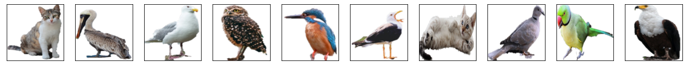
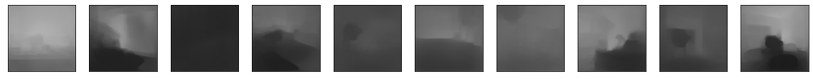

# Problem Statement EVA 4, Session 14 & 15 : DepthMap

Assignment: 

- Objective: Create a custom/synthetic dataset for traning model to predict depth map and mask. Since the data needed is from RGBD camera and its not available in public dataset, we are create our own custom dataset.

- Target to have 100 background, 100x2 (including flip), and you randomly place the foreground on the background 20 times, you have in total 100x200x20 images. 

Now add a readme file on GitHub for Project 15A:
- Created custom dataset and link is here https://drive.google.com/drive/folders/11_GAGUXv1F2cfaBu1NTxKyFotx3iGD0O?usp=sharing
- Dataset details and statistics:
  - Foreground images include 100 birds & cat
  -  
  - Background images includes 100 from indoor and outdoor of rooms/hotels/office
  - 
  - Foreground and Background combinations (400k: 100 bg x 100 fg x 2 flip x 20 random locations)
  - 
  - Mask of combination (400k, mask of above images) 
  -  
  - Depth Map of above images (400k)
  -  
  - Mean/STD values for your fg_bg, masks and depth images
- Explaining steps followed to create dataset
  - Foreground created with transparency: Randomly selected images from internet with CC0 license and then removed background using powerpoint.
  - Masks for foreground was created using GIMP by selecting the alpha region and filling the space with white.
  - Overlay the fg over bg and created 20 variants: Using combination of 100 fg with flip (x2) and 100 bg and placing foreground images randomly. Used PIL python library for combining the images.
  - Depth images was created using the deep learning model (https://github.com/ialhashim/DenseDepth/blob/master/DenseDepth.ipynb) prediction.
  - Notebook file, used to create this dataset: https://github.com/sujitojha1/EVA4/blob/rev7/S14_15/EVA4_S15a_Solution_DenseDepth_v1.ipynb
  - Notebook file, used to calculate statistics for this dataset:https://github.com/sujitojha1/EVA4/blob/rev7/S14_15/EVA4_S15a_Solution_DenseDepth_v1.ipynb
